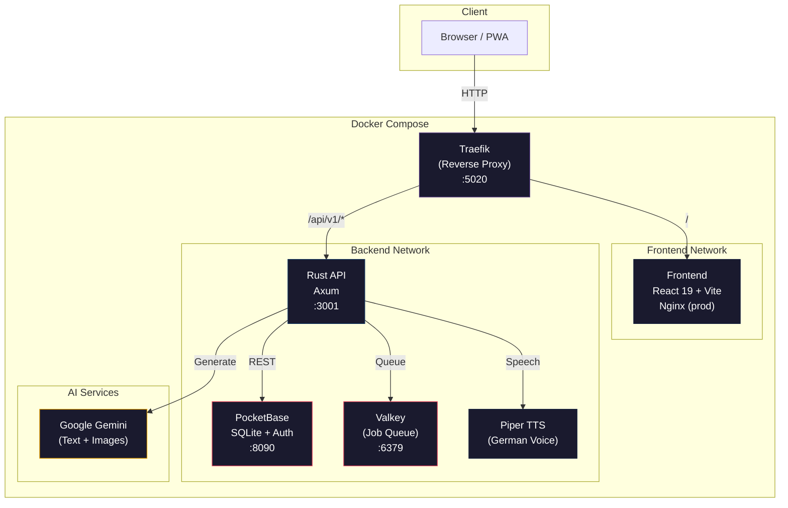
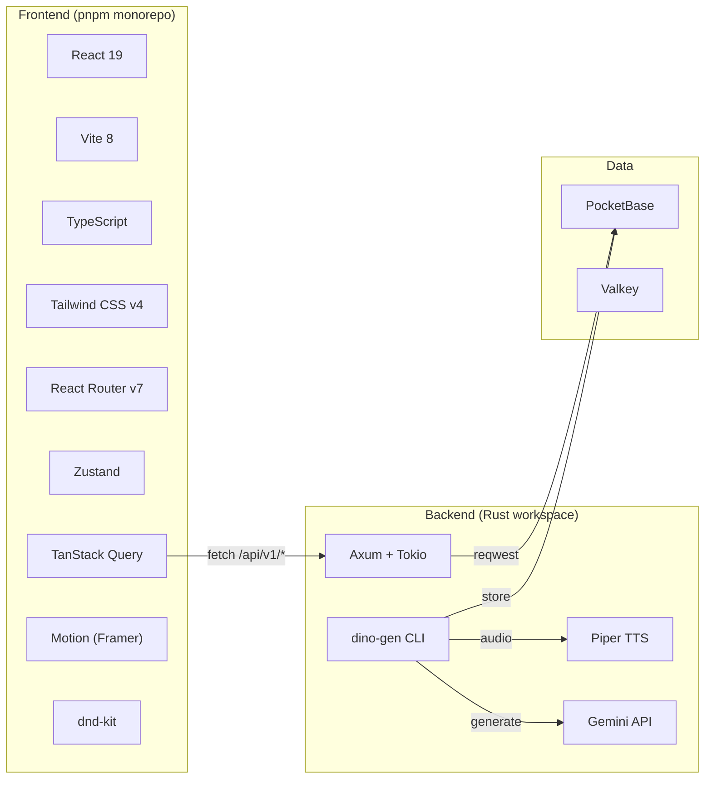
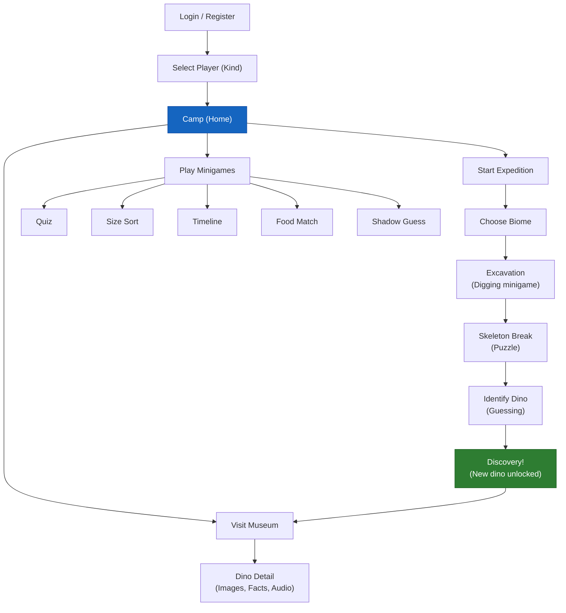
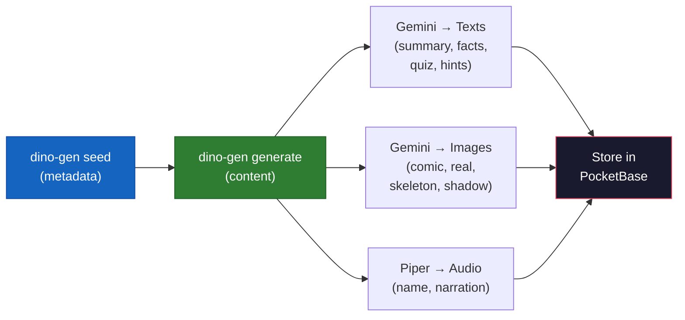

<p align="center">
  
</p>

<h1 align="center">Dino Atlas</h1>

<p align="center">
  <strong>An interactive dinosaur discovery game for kids — with AI-generated content, expeditions, and a personal museum.</strong><br/>
  Children explore biomes, excavate fossils, discover dinosaurs, and learn through minigames. All content (illustrations, facts, audio) is generated via Google Gemini and local TTS.
</p>

<p align="center">
  <a href="#quick-start">Quick Start</a> &bull;
  <a href="#architecture">Architecture</a> &bull;
  <a href="#content-generation">Content Generation</a> &bull;
  <a href="#api-reference">API Reference</a> &bull;
  <a href="#deployment">Deployment</a> &bull;
  <a href="#contributing">Contributing</a>
</p>

---

## Quick Start

### Prerequisites

- [Docker](https://docs.docker.com/get-docker/) & Docker Compose v2+
- A [Google Gemini API key](https://aistudio.google.com/apikey) (for content generation)
- No other local dependencies needed — everything runs containerized.

### 1. Clone & configure

```bash
git clone https://github.com/your-org/dino-atlas.git
cd dino-atlas
cp .env.example .env
```

Edit `.env` and set the **required** values:

| Variable | Description |
|---|---|
| `POCKETBASE_ADMIN_PASSWORD` | Generate with `openssl rand -base64 32` |
| `JWT_SECRET` | Min 32 chars. Generate with `openssl rand -base64 48` |
| `GEMINI_API_KEY` | Google Gemini API key for content generation |

### 2. Start services

#### Development (hot-reload, live editing)

```bash
make dev          # Foreground with logs
# or
make infra-up     # Infrastructure only (background)
```

Uses `docker-compose.override.yml` which starts:
- **Frontend:** Vite dev server with hot-reload (source mounted)
- **Backend:** cargo-watch with auto-rebuild (source mounted)
- Changes to `frontend/` and `backend/` are reflected instantly.

#### Production (optimized builds, Nginx)

```bash
make prod-up      # Detached (background)
```

Skips the override file and uses the production Dockerfiles:
- **Frontend:** Multi-stage build → Nginx with static assets
- **Backend:** Release build with full optimizations
- No hot-reload, no source mounts.

### 3. Seed the database

```bash
make seed
```

This imports the PocketBase schema and base collections.

### 4. Generate dinosaur content

```bash
docker compose exec api dino-gen seed              # Import base dino metadata
docker compose exec api dino-gen generate all       # Generate texts, images & audio for all dinos
```

See [Content Generation](#content-generation) for details.

### 5. Open the app

| URL | Service |
|---|---|
| [http://localhost:5020](http://localhost:5020) | Frontend App |
| [http://localhost:5020/api/docs](http://localhost:5020/api/docs) | Swagger API Docs |
| [http://localhost:5021](http://localhost:5021) | PocketBase Admin |
| [http://localhost:5022](http://localhost:5022) | Storybook (with `make dev-storybook`) |

### Available Make targets

```
Development:
  make dev              Start in dev mode with logs (foreground)
  make dev-storybook    Start dev mode + Storybook UI explorer
  make infra-up         Start infrastructure only (background)
  make infra-down       Stop all services

Production:
  make prod-up          Start in prod mode (Nginx + optimized builds)
  make prod-down        Stop prod services
  make prod-restart     Restart prod services

Build:
  make build            Build all Docker images (dev)
  make build-prod       Build all Docker images (prod)

Data:
  make seed             Import PocketBase schema
  make reset            Wipe database and re-seed

Testing:
  make test             Run all tests (frontend + backend)
  make test-backend     Run Rust tests only
  make test-frontend    Run frontend tests only

Tunnel:
  make tunnel           Start Cloudflare tunnel (production)
  make tunnel-stop      Stop tunnel
  make tunnel-logs      Tail tunnel logs

Logs:
  make logs             Tail all service logs
  make logs-api         Tail API logs only

Backup:
  make backup           Backup PocketBase data to ./backups/
  make restore FILE=… Restore from a backup file

Cleanup:
  make clean            Remove all containers, volumes & build artifacts
```

---

## Architecture

### System Overview



> **Key rule:** The frontend **never** talks directly to PocketBase. All requests go through the Rust backend. PocketBase is an internal implementation detail.

### Tech Stack



### Game Flow



---

## Content Generation

Dino Atlas uses **AI-generated content** for all dinosaur data. The `dino-gen` CLI tool handles the full pipeline.

### What gets generated

| Type | Source | Description |
|---|---|---|
| **Texts** | Gemini | Kid-friendly summary, fun facts, quiz questions, food options, identify hints |
| **Comic image** | Gemini | Cartoon sticker-style illustration |
| **Realistic image** | Gemini | Photorealistic scientific rendering |
| **Skeleton image** | Gemini | Fossil / excavation illustration |
| **Shadow image** | Gemini | Silhouette for shadow guess minigame |
| **Audio** | Piper TTS | German name pronunciation & narration |

### dino-gen commands

```bash
# Seed base dinosaur metadata (no content yet)
dino-gen seed

# Generate all content for all dinos
dino-gen generate all

# Generate content for a single dino
dino-gen generate triceratops

# Only generate specific content types
dino-gen generate all --only texts
dino-gen generate all --only comic
dino-gen generate all --only audio

# Skip dinos that already have content
dino-gen generate all --skip-existing

# AI-discover new dinosaurs
dino-gen discover --count 5 --generate

# Check generation status
dino-gen status

# View AI API costs
dino-gen costs

# Test TTS output
dino-gen tts-test "Tyrannosaurus Rex"

# Generate bedtime story for a family
dino-gen generate-story <family_id>
```

### Generation pipeline



### Running in Docker

```bash
# Via docker compose (recommended)
docker compose exec api dino-gen seed
docker compose exec api dino-gen generate all
docker compose exec api dino-gen status

# Or build and run locally (requires Rust toolchain + Piper)
cd backend
cargo run -p dino-gen -- generate all
```

---

## API Reference

All endpoints are under `/api/v1`. Protected routes require a session cookie (httpOnly). Full Swagger docs available at `/api/docs`.

### Authentication

| Method | Endpoint | Description |
|---|---|---|
| `POST` | `/auth/register` | Create family account |
| `POST` | `/auth/login` | Login, sets session cookie |
| `POST` | `/auth/logout` | Logout, clears session |
| `GET` | `/auth/me` | Current user, family & players |

### Players

| Method | Endpoint | Description |
|---|---|---|
| `POST` | `/players` | Add child to family |

### Museum

| Method | Endpoint | Description |
|---|---|---|
| `GET` | `/museum` | Player's discovered dino collection |

### Expeditions

| Method | Endpoint | Description |
|---|---|---|
| `GET` | `/expedition/active` | Get active expedition |
| `POST` | `/expedition/start` | Start new expedition |
| `POST` | `/expedition/advance` | Progress through expedition phases |

### Minigames

| Method | Endpoint | Description |
|---|---|---|
| `GET` | `/minigames/available` | Available minigames & dinos |
| `POST` | `/minigames/complete` | Record minigame completion |

### Dinos

| Method | Endpoint | Description |
|---|---|---|
| `GET` | `/dinos` | List all dinos with metadata |
| `GET` | `/dinos/{id}` | Single dino details |

### Budget

| Method | Endpoint | Description |
|---|---|---|
| `GET` | `/budget` | Daily activity budget (expeditions/minigames) |

### TTS

| Method | Endpoint | Description |
|---|---|---|
| `GET` | `/tts` | Generate German speech audio (cached) |

---

## Project Structure

```
dino-atlas/
├── frontend/                        # React monorepo (pnpm)
│   ├── apps/
│   │   ├── app/                     # Main game app
│   │   │   ├── src/
│   │   │   │   ├── components/      # Layout, guards
│   │   │   │   ├── pages/           # Route-level pages
│   │   │   │   ├── stores/          # Zustand state stores
│   │   │   │   └── lib/             # API client, utilities
│   │   │   ├── Dockerfile           # Production (Nginx)
│   │   │   └── Dockerfile.dev       # Development (Vite hot-reload)
│   │   ├── landing/                 # Marketing landing page
│   │   └── storybook/               # Component explorer
│   └── packages/
│       ├── ui/                      # Shared screens & components
│       ├── minigames/               # Minigame logic & components
│       └── types/                   # Shared TypeScript types
│
├── backend/                         # Rust workspace
│   ├── api/                         # Main REST API (Axum)
│   ├── dino-gen/                    # Content generation CLI
│   ├── generator/                   # Background job worker
│   ├── core/                        # Shared domain models
│   └── tts/                         # Piper TTS wrapper
│
├── services/
│   ├── pocketbase/seed/             # DB schema & seed scripts
│   ├── traefik/dynamic/             # Rate limiting, CORS config
│   └── tts/                         # TTS Docker service
│
├── docker-compose.yml               # Production compose
├── docker-compose.override.yml      # Dev overrides (hot-reload)
├── Makefile                         # Development commands
└── .env.example                     # Environment template
```

---

## Security

- **Network isolation:** PocketBase and Valkey are only accessible from the backend network — never exposed to the internet.
- **JWT sessions:** httpOnly cookies with secure session management.
- **Rate limiting:** Auth endpoints: 10 req/s, API: 60 req/s (via Traefik middleware).
- **Security headers:** HSTS, X-Frame-Options DENY, X-Content-Type-Options nosniff.
- **CORS:** Restricted to configured origins only.
- **No direct DB access:** Frontend communicates exclusively through the Rust API.

---

## Deployment

Production runs the same Docker Compose stack, exposed via a **Cloudflare Tunnel**.

### Dev vs. Production

| | Development | Production |
|---|---|---|
| **Command** | `make dev` | `make prod-up` |
| **Frontend** | Vite dev server (hot-reload) | Nginx with static build |
| **Backend** | cargo-watch (auto-rebuild) | Optimized release binary |
| **Source** | Mounted from host | Baked into image |
| **Compose file** | `docker-compose.yml` + `override.yml` | `docker-compose.yml` only |

### Production setup

1. Create a Cloudflare Tunnel in the [Zero Trust Dashboard](https://one.dash.cloudflare.com/)
2. Add `CLOUDFLARE_TUNNEL_TOKEN` to your `.env`
3. Set `ALLOWED_ORIGINS` to your production domain
4. Run:

```bash
make prod-up       # Start all services
make tunnel        # Expose via Cloudflare Tunnel
```

### Rebuilding after changes

```bash
# Rebuild and restart a single service
docker compose -f docker-compose.yml up -d --build app    # Frontend only
docker compose -f docker-compose.yml up -d --build api    # Backend only

# Rebuild everything
make build-prod && make prod-restart
```

---

## Contributing

1. Fork the repository
2. Create a feature branch (`git checkout -b feat/my-feature`)
3. Run `make dev` and `make seed` to get a local environment
4. Make your changes
5. Run `make test` to verify
6. Open a Pull Request

---

## License

See [LICENSE](LICENSE) for details.
